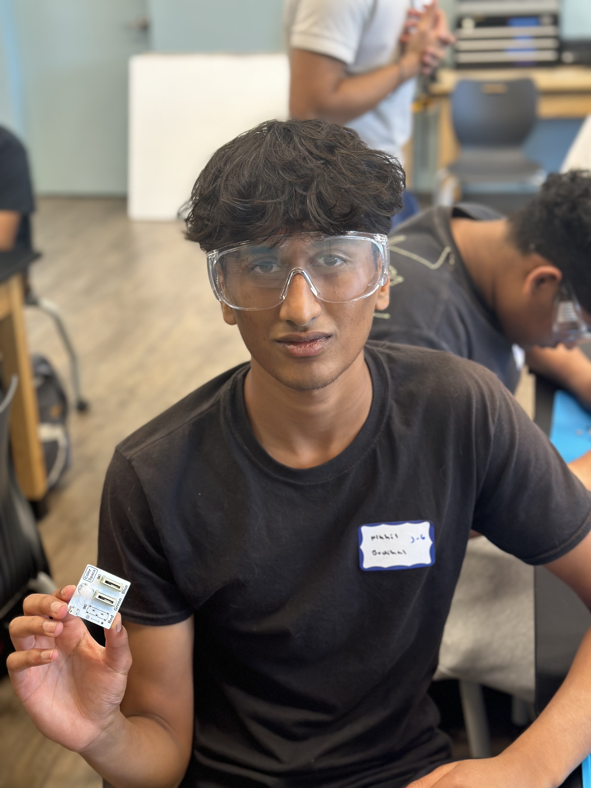
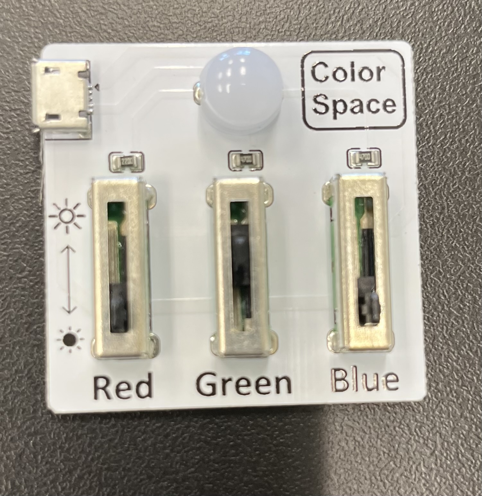
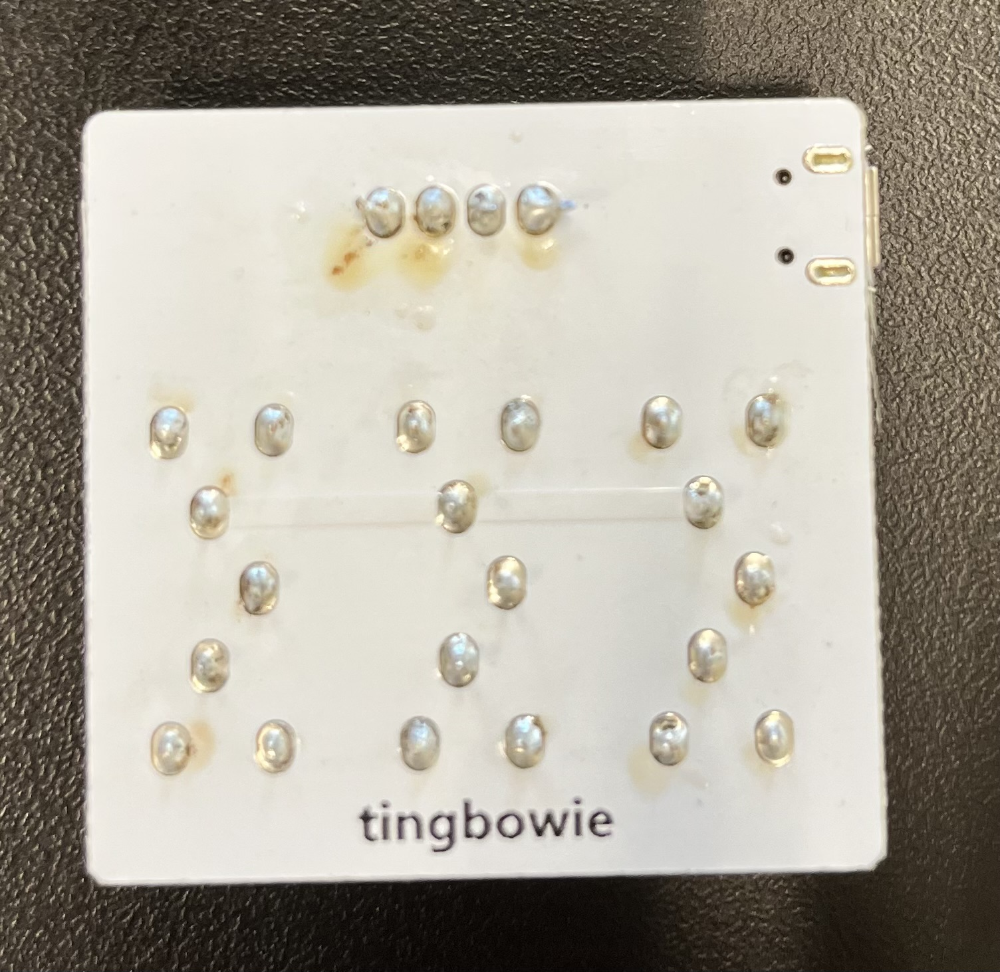

# Custom Object Detection
<!-- Replace this text with a brief description (2-3 sentences) of your project. This description should draw the reader in and make them interested in what you've built. You can include what the biggest challenges, takeaways, and triumphs from completing the project were. As you complete your portfolio, remember your audience is less familiar than you are with all that your project entails! -->


| **Engineer** | **School** | **Area of Interest** | **Grade** |
|:--:|:--:|:--:|:--:|
| Nikhil B | Irvington High School | Electrical Engineering | Incoming Sophomore

<!-- **Replace the BlueStamp logo below with an image of yourself and your completed project. Follow the guide [here](https://tomcam.github.io/least-github-pages/adding-images-github-pages-site.html) if you need help.** -->


  
 <!-- # Final Milestone

**Don't forget to replace the text below with the embedding for your milestone video. Go to Youtube, click Share -> Embed, and copy and paste the code to replace what's below.**

<iframe width="560" height="315" src="https://www.youtube.com/embed/F7M7imOVGug" title="YouTube video player" frameborder="0" allow="accelerometer; autoplay; clipboard-write; encrypted-media; gyroscope; picture-in-picture; web-share" allowfullscreen></iframe>

For your final milestone, explain the outcome of your project. Key details to include are:
- What you've accomplished since your previous milestone
- What your biggest challenges and triumphs were at BSE
- A summary of key topics you learned about
- What you hope to learn in the future after everything you've learned at BSE -->


# Second Milestone

<!-- **Don't forget to replace the text below with the embedding for your milestone video. Go to Youtube, click Share -> Embed, and copy and paste the code to replace what's below.** -->

<iframe width="996" height="560" src="https://www.youtube.com/embed/ziyV15nrAKM" title="Nikhil B. Milestone 2" frameborder="0" allow="accelerometer; autoplay; clipboard-write; encrypted-media; gyroscope; picture-in-picture; web-share" referrerpolicy="strict-origin-when-cross-origin" allowfullscreen></iframe>

For my second milestone I have downloaded all the software required for my object detection system to work. This includes Tensorflow for the object detection, Blinka for the display, and a few more files for the camera. At this point my project can detect certain objects within the Tensorflow database using the raspberry pi camera and display them on the display. Something that surprised me were the amount of files and packages that requred downloading to get all of the components working. The biggest challenge I faced was using a virtual environment to download necessary files. Virtual environments allow me to download specific versions of files without affecting the rest of my raspberry pi system. I struggled setting these virtual environments up and deactivating them. In order to complete my final milestone, I need to train my project to detect specific objects using the Teachable Machine software. This will allow me to expand the amount of dectable objects further than just the tensorflow database. 

# First Milestone

<!-- **Don't forget to replace the text below with the embedding for your milestone video. Go to Youtube, click Share -> Embed, and copy and paste the code to replace what's below.** -->

<iframe width="996" height="560" src="https://www.youtube.com/embed/_Q_0KqwxaLQ" title="Nikhil B. Milestone 1" frameborder="0" allow="accelerometer; autoplay; clipboard-write; encrypted-media; gyroscope; picture-in-picture; web-share" referrerpolicy="strict-origin-when-cross-origin" allowfullscreen></iframe>

My project has three main hardware components. 1. The raspberry pi is the main brain, and connects everything together. 2. The camera is connected to the raspberry pi, and is the eyes of the project. The display allows the user to see what the camera is seeing. So far, I have combined all my hardware components together and set up an SSH so I can access raspberry pi command line from my mac. In addition I have installed a VNC so I can access the raspberry pi's user interface from my mac. I have also initialized the camera and have taken some initial test pictures. To summarize I have completed most of the hardware components of my project in addition to the setup of the raspberry pi. The biggest challenge I faced was a power issue with the raspberry pi. The flashing light indicated that there was a power shortage, though I had used the correct 5 volt power supply. When I disconnocted my display, the power issue solved, and I realised I had plugged in my display backwards. After fixing this issue the power issue with the pi also resolved. To continue with my project, I have to download teachable machine to train my raspberry pi to detect objects. In addition I have to setup more software with the raspberry pi to make the project complete. 

<!-- # Schematics 
Here's where you'll put images of your schematics. [Tinkercad](https://www.tinkercad.com/blog/official-guide-to-tinkercad-circuits) and [Fritzing](https://fritzing.org/learning/) are both great resoruces to create professional schematic diagrams, though BSE recommends Tinkercad becuase it can be done easily and for free in the browser. 

# Code
Here's where you'll put your code. The syntax below places it into a block of code. Follow the guide [here]([url](https://www.markdownguide.org/extended-syntax/)) to learn how to customize it to your project needs. -->

```c++
import RPi.GPIO as GPIO
import time
import cv2
import numpy as np
from picamera2 import Picamera2
from tflite_runtime.interpreter import Interpreter

# === Servo Setup ===
GPIO.setmode(GPIO.BCM)
servo_pin = 17
GPIO.setup(servo_pin, GPIO.OUT)

pwm = GPIO.PWM(servo_pin, 50)  # 50 Hz for servo
pwm_started = False  # Start only when needed

def set_angle(angle, delay=0.4):
    global pwm_started
    if not pwm_started:
        pwm.start(0)
        pwm_started = True
        time.sleep(0.1)

    duty = 2 + (angle / 18)
    pwm.ChangeDutyCycle(duty)
    time.sleep(delay)
    pwm.ChangeDutyCycle(0)

def tilt_servo(label):
    if label == "Penny":
        print("? Penny detected ? tilting RIGHT")
        set_angle(120)
    elif label == "Quarter":
        print("? Quarter detected ? tilting LEFT")
        set_angle(60)
    time.sleep(0.4)
    print("?? Returning to CENTER")
    set_angle(90)

# === Model and label loading ===
MODEL_PATH = "/home/nikhilbudihal/model/model_unquant.tflite"
LABEL_PATH = "/home/nikhilbudihal/model/labels.txt"

def load_labels(path):
    with open(path, 'r') as f:
        return [line.strip() for line in f.readlines()]

labels = load_labels(LABEL_PATH)

interpreter = Interpreter(MODEL_PATH)
interpreter.allocate_tensors()
input_details = interpreter.get_input_details()
_, height, width, _ = input_details[0]['shape']

# === Classification ===
def classify_image(image):
    input_tensor = np.expand_dims(image.astype(np.float32) / 255.0, axis=0)
    interpreter.set_tensor(input_details[0]['index'], input_tensor)
    interpreter.invoke()
    output = interpreter.get_tensor(interpreter.get_output_details()[0]['index'])[0]
    return np.argmax(output), output[np.argmax(output)]

# === Camera setup ===
picam2 = Picamera2()
picam2.preview_configuration.main.size = (250, 250)
picam2.preview_configuration.main.format = "RGB888"
picam2.configure("preview")
picam2.start()
picam2.set_controls({"AfMode": 0, "LensPosition": 1.0})

# === OpenCV fullscreen display ===
WINDOW_NAME = "Picamera2 - Coin Detection"
cv2.namedWindow(WINDOW_NAME, cv2.WND_PROP_FULLSCREEN)
cv2.setWindowProperty(WINDOW_NAME, cv2.WND_PROP_FULLSCREEN, cv2.WINDOW_FULLSCREEN)

# === Detection logic ===
CONFIDENCE_THRESHOLD = 0.7
HOLD_TIME = 1

current_label = None
start_time = None
action_done = False

print("? Ready. Servo stays at 90° until a confident match is held for 3 seconds.")

try:
    while True:
        frame = picam2.capture_array()
        resized = cv2.resize(frame, (width, height))

        label_id, confidence = classify_image(resized)
        label = labels[label_id]
        now = time.time()

        # Detection + timer logic
        if confidence >= CONFIDENCE_THRESHOLD and label in ["Penny", "Quarter"]:
            if label == current_label:
                if start_time is None:
                    start_time = now
                elif (now - start_time >= HOLD_TIME) and not action_done:
                    tilt_servo(label)
                    action_done = True
            else:
                current_label = label
                start_time = now
                action_done = False
        else:
            current_label = None
            start_time = None
            action_done = False

        # Display frame with label overlay
        display_frame = cv2.resize(frame, (244, 244))
        if confidence >= CONFIDENCE_THRESHOLD:
            label_text = f"{label}"
            color = (0, 255, 0) if confidence >= 0.75 else (0, 0, 255)
            font = cv2.FONT_HERSHEY_SIMPLEX
            font_scale = 0.7
            thickness = 2
            text_size, _ = cv2.getTextSize(label_text, font, font_scale, thickness)
            text_x = (244 - text_size[0]) // 2
            text_y = 244 - 10
            cv2.putText(display_frame, label_text, (text_x, text_y),
                        font, font_scale, color, thickness)

        cv2.imshow(WINDOW_NAME, display_frame)

        if cv2.waitKey(1) & 0xFF == ord('q'):
            break

finally:
    print("? Cleaning up GPIO and camera")
    if pwm_started:
        pwm.stop()
    GPIO.cleanup()
    picam2.stop()
    cv2.destroyAllWindows()
```


 # Bill of Materials
<!--Here's where you'll list the parts in your project. To add more rows, just copy and paste the example rows below.
Don't forget to place the link of where to buy each component inside the quotation marks in the corresponding row after href =. Follow the guide [here]([url](https://www.markdownguide.org/extended-syntax/)) to learn how to customize this to your project needs. -->

| **Part** | **Note** | **Price** | **Link** |
|:--:|:--:|:--:|:--:|
| Raspberry Pi (Canakit) | Computer System that controls everything | $199.99 | <a href="https://www.amazon.com/CanaKit-Raspberry-4GB-Starter-Kit/dp/B07V5JTMV9/ref=sr_1_3?crid=RKVPRUNT9HW5&dib=eyJ2IjoiMSJ9.na9CetPjFi_FxZyBgpAsrzsNv6dicwLzRFdua87NS7K3F1jRt8gqGO5--fumv5e3wfR7IXE8-SKZvldeVpniJ2BEIHHF7MHQJpaveZRn_FfB0ggQ_kbr9AVJquOMaf7t0vGL1YRe3nGzoeLzZWmVoGMNH3c3VkS4jVMxkgGswLoSYxc3zNNOlttTrGmGPdfEwZjXKIOaJ8ZpwnpEKmplEpwfnSCulGvOeuoYn3ghyuU.g7jXOZ3fJji-DZgtkWeYRzS2_bk0jwq_aNtQdSqk9_w&dib_tag=se&keywords=raspberry%2Bpi%2Bcanakit&qid=1752508604&sprefix=raspberry%2Bpi%2Bcanaki%2Caps%2C188&sr=8-3&th=1"> Link </a> |
| Adafruit Braincraft HAT | Contains project's display | $44.95 | <a href="https://www.adafruit.com/product/4374"> Link </a> |
| Pi Camera Module 3 | Gives Raspberry pi data for object detection | $69.99 | <a href="https://www.amazon.com/Arduino-A000066-ARDUINO-UNO-R3/dp/B008GRTSV6/"> Link </a> |
| MG90S Servo Motor | Turns tilt platform | $18.99 | <a href="https://www.amazon.com/Micro-Helicopter-Airplane-Remote-Control/dp/B072V529YD/ref=sr_1_3_sspa?crid=5JI2QKPNJIA4&dib=eyJ2IjoiMSJ9.0_jFSoWbbk3Z_csthCBHZoU8japUlXywulC3h_nRPD_Oi4VJXSrVMybbQStOBQgi2a3MDjqUaREZk7Jl3nnHZbI075cuo_aAUxZOc3xxufmqp-Ru29-mraRSrVwjbEb3blPBrAr1Sinc7r8CkTmkGpK3qRyHdNg6HBK0c_hDVNBJjidn1CLVM_wVhkuHHs87iaZedcKx7t8xlGreGSQakv5iygRS6Dzd_sVg0UcAIgoGo8hl2cIrP3mF8CbqJhyKZr93ezgVJMNYqJHLXLzJyZ8f1q2sjoR37Kb69T3322E.3TkE72V7O8yAtnQ1C1chwjDOaQzQAJbQJsuwp1MKu-o&dib_tag=se&keywords=mgs90+servo&qid=1752509698&sprefix=mgs90+serv%2Caps%2C144&sr=8-3-spons&sp_csd=d2lkZ2V0TmFtZT1zcF9hdGY&psc=1"> Link </a> |
| Tilt Adjustable Camera Mount | What the item is used for | $15.99 | <a href="https://www.amazon.com/Adjustable-Raspberry-Camera-Module-Mount/dp/B08C26BQ52/ref=sr_1_3?crid=1ZL3WOSWBMS6M&dib=eyJ2IjoiMSJ9.TqlZmjr0O5aa1r38Imx8Ru5iY7GUOBDFySO-hcwsYUCiMm9BKzZuhOBK1fn6a4KVuiy38YhJ8cNFddRW5s4Et6pvnAPtdy_0YohOxMV3xpWP3Oh4xFIPursbkmJcE6uZ0AmFG-qpSwqUdl1JTmySzfZmJhgu1Fj0QCyFp73-dvHAF6pyV3-4DAunykzz0BPMPTK5Yo1K-8LIzxpjfaCNlypxYZnNeK2ZwQFIpPW0180.cMTB9PhrvdC34d8TWeGSgYJlsI_SJs_ZSf6lJ0SUg48&dib_tag=se&keywords=tilt+adjustable+camera+mount+pi+camera&qid=1752509252&sprefix=tilt+adjustable+camera+mount+pi+cam%2Caps%2C198&sr=8-3"> Link </a> |
| 24 inch Camera Cable | Connects Pi to  Camera | $5.29 | <a href="https://www.amazon.com/A1-FFCs-Black-Raspberry-Camera/dp/B07J57LQQS/ref=sr_1_2?crid=2YINV8NU8JSO9&dib=eyJ2IjoiMSJ9.DZGae9hBk8bzIu_5DilHejPAvx6pr0nea3uDvigieHZwbWOYFJaIuEHA9Fni0h9zNq6gia_k7Vojpbxjt78bKQizziNX5PnQu5-JqJrk75472UR9WiRNNppsAA14AF1LfnZoX6XDQhQ3kkDOP_k5SPqqoOZjMB4qdRF2bTdg5fraTgukdb3-gkUfg-ufi-KK1AyugNeD7Tvs-Js27kvMTma203fTBD5ehr5EYA5R-n8.YzUDyhJ-xvI6ZZkm7Vn7YQpvK0SNHpBo4zE7hBTVbDk&dib_tag=se&keywords=24%2Binch%2Braspberry%2Bpi%2Bcamera%2Bcable&qid=1752509322&sprefix=24%2Binch%2Braspberry%2Bpi%2Bcamera%2Bcab%2Caps%2C211&sr=8-2&th=1"> Link </a> |
| 40 pin GPOI Ribbon Cable | Connects HAT to Pi | $7.99 | <a href="https://www.amazon.com/UCTRONICS-Breadboard-Connection-Raspberry-Display/dp/B07D991KMR/ref=sr_1_2?crid=DAG9M6IJVHKX&dib=eyJ2IjoiMSJ9.uPEqXLFngmxIe7ViT64CedFGUPdTy_O4--ZTRLbb9Xr2yWz_Oy9RvfR8euzzuwVSxMeQqoRIiSZPVCyjGcicCX0qbT0WNdaJnO9zfAJJTow7x4nw4jKGVK1I5WG9eFRyhYFKKqIHIYQDGoVx440mDqvUApF3wM1Uw_ZsQJyZITUEOkjeFawkSa4eg0lWTHqPCx47BOMUlLCST3wXtsvsk6JOqni4t6Flnp1YFNurrmY.BUK_NQ01lzjnclJP5bnVSwZgxJPXu_3I8Jqnpq7yUGw&dib_tag=se&keywords=40pin%2Bgpio%2Bribbon&qid=1752509454&sprefix=40pin%2Bgpio%2Bribb%2Caps%2C229&sr=8-2&th=1"> Link </a> |


<!-- # Other Resources/Examples
One of the best parts about Github is that you can view how other people set up their own work. Here are some past BSE portfolios that are awesome examples. You can view how they set up their portfolio, and you can view their index.md files to understand how they implemented different portfolio components.
- [Example 1](https://trashytuber.github.io/YimingJiaBlueStamp/)
- [Example 2](https://sviatil0.github.io/Sviatoslav_BSE/)
- [Example 3](https://arneshkumar.github.io/arneshbluestamp/)

To watch the BSE tutorial on how to create a portfolio, click here. -->

# RGB Slider Starter Project

<iframe width="560" height="315" src="https://www.youtube.com/embed/H3ha4P-BtGU?si=SNCBHWR4-BfBcK5f" title="YouTube video player" frameborder="0" allow="accelerometer; autoplay; clipboard-write; encrypted-media; gyroscope; picture-in-picture; web-share" referrerpolicy="strict-origin-when-cross-origin" allowfullscreen></iframe>

The RGB Slider came with a board, 3 sliders, and a light. The three sliders work together to create a different shade of color on the light. In order to put all the pieces together, I soldered the sliders, and the light to the board. The main challenge I faced was adding to much solder to the connections. I had to be careful not to short any connections, and I made to use a multimeter to check all my connections. The RGB slider ended up working when I plugged it in. It allowed me to be more confident with using a soldering iron. 

 
